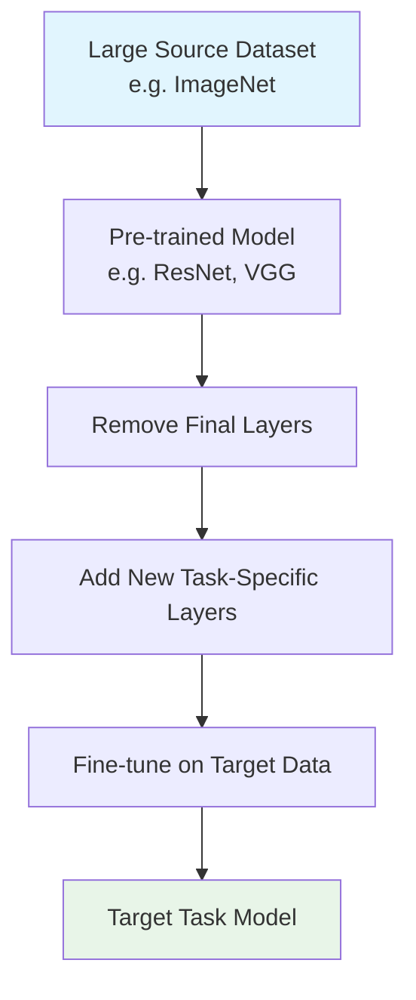
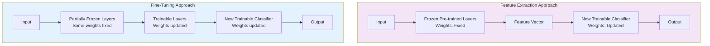
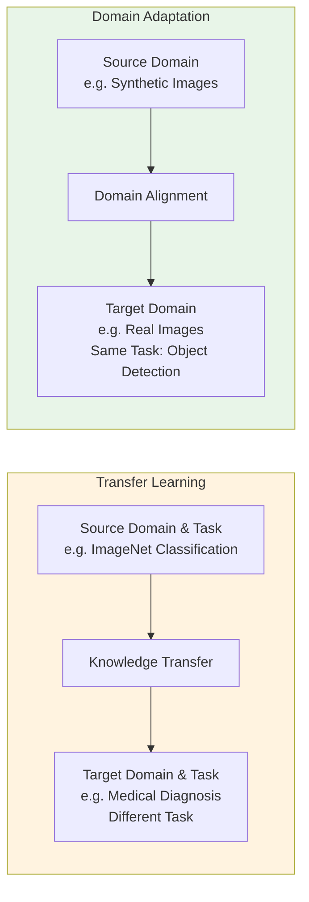
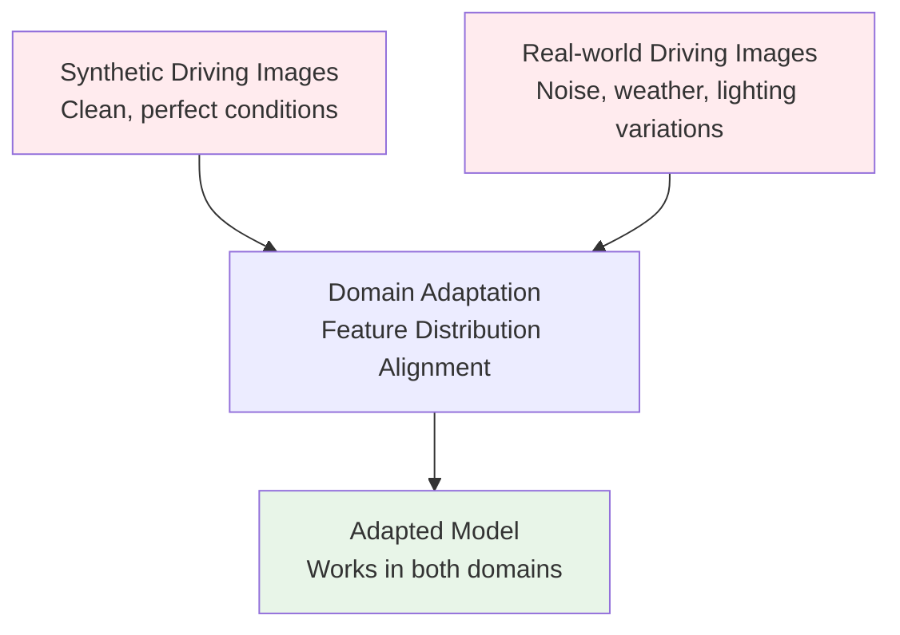

# **Q1. Explain the architecture and working of an Autoencoder. Derive the mathematical formulation for the encoding and decoding processes, and illustrate how the reconstruction loss is minimized.**

---

## **Answer:**

### **1️⃣ Definition:**

An **Autoencoder** is a type of **neural network** used for **unsupervised learning** that aims to **learn a compressed (latent) representation** of the input data and then **reconstruct it** as accurately as possible.

It consists of two main parts:

- **Encoder:** Compresses the input into a lower-dimensional representation (latent space)
- **Decoder:** Reconstructs the input from this compressed representation

---

### **2️⃣ Architecture:**

```
Input → Encoder → Bottleneck → Decoder → Output (Reconstruction)
```

- The **bottleneck layer** is the **compressed latent space** that forces the model to learn only the most **relevant features** of the input data

---

### **3️⃣ Working Principle:**

#### **Encoder:**
Maps input vector `x` to a lower-dimensional latent vector `h`:
```
h = f(W_e * x + b_e)
```
where  
`W_e` = encoder weight matrix,  
`b_e` = bias,  
`f` = activation function (e.g., ReLU, sigmoid)

#### **Decoder:**
Reconstructs the original input from `h`:
```
x̂ = g(W_d * h + b_d)
```
where  
`W_d` = decoder weight matrix,  
`b_d` = bias,  
`g` = output activation function

---

### **4️⃣ Loss Function:**

The goal is to make `x̂` as close as possible to `x`.  
The **Reconstruction Loss** is minimized:
```
L(x, x̂) = ||x - x̂||² = Σ(x_i - x̂_i)²
```

👉 For **binary inputs**, the **Binary Cross-Entropy (BCE)** loss can be used:
```
L(x, x̂) = -Σ[x_i * log(x̂_i) + (1 - x_i) * log(1 - x̂_i)]
```

---

### **5️⃣ Optimization:**

Weights `W_e, W_d` are updated using **backpropagation** and **gradient descent** to minimize `L(x, x̂)`

---

### **6️⃣ Key Idea:**

The **bottleneck layer** forces the network to **learn a compact, meaningful representation** — effectively performing **dimensionality reduction** similar to PCA, but **non-linear** and **data-driven**

---

### **Applications:**

- Image denoising
- Dimensionality reduction
- Feature learning
- Machine translation (Encoder–Decoder sequence models)

---

---

# **Q2. What are Regularized Autoencoders? Compare Sparse Autoencoder, Denoising Autoencoder, and Variational Autoencoder (VAE) in terms of their architecture, regularization techniques, and objectives.**

---

## **Answer:**

### **1️⃣ Regularized Autoencoders:**

These are **modified Autoencoders** that include **constraints or noise** during training to prevent the network from simply copying the input and to make the learned representations more **robust and meaningful**

---

## **Comparison Table:**

| **Type** | **Architecture** | **Regularization Technique** | **Objective** |
|----------|------------------|------------------------------|---------------|
| **Sparse Autoencoder** | Standard encoder-decoder with sparsity constraint | Adds sparsity penalty using KL divergence: `Ω = Σ KL(ρ ‖ ρ̂_j)` | Learn distinct, independent features |
| **Denoising Autoencoder** | Trained on noisy input, outputs clean reconstruction | Input corruption: `x̃ = x + noise` | Learn robust, noise-resistant features |
| **Variational Autoencoder** | Encoder outputs distribution parameters (μ, σ) | KL divergence between latent distribution and Normal prior | Learn generative latent space for data generation |

---

### **2️⃣ Mathematical Details:**

#### **Sparse Autoencoder:**
```
Loss = Reconstruction Loss + λ * Sparsity Penalty
Ω = Σ[ρ * log(ρ/ρ̂_j) + (1-ρ) * log((1-ρ)/(1-ρ̂_j))]
```

#### **Denoising Autoencoder:**
```
Input: x̃ = corrupt(x)
Target: reconstruct original x
Loss = ||x - x̂||²
```

#### **Variational Autoencoder:**
```
Loss = Reconstruction Loss + KL Divergence
L = E[log p(x|z)] - KL(q(z|x) || p(z))
```

**Reparameterization Trick:**
```
z = μ + σ ⊙ ε, where ε ∼ N(0, I)
```

---

### **3️⃣ Summary:**

| **Autoencoder Type** | **Goal** | **Special Property** |
|---------------------|----------|----------------------|
| Sparse AE | Learn compact, interpretable features | Enforces sparsity using KL divergence |
| Denoising AE | Learn noise-robust representation | Reconstructs clean input from noisy data |
| Variational AE | Learn generative latent space | Produces new samples, uses reparameterization |

---

### **4️⃣ Key Takeaways:**

- Regularization prevents overfitting and helps extract **useful representations**
- **VAE** is the foundation for **modern generative models** like **GANs** and **Transformers**
- These autoencoders are used in **feature extraction**, **image restoration**, **data generation**, and **representation learning**


  # **Q3. Explain the concept of Greedy Layer-wise Unsupervised Pre-Training. How does it help in training deep neural networks effectively compared to end-to-end training?**

---

## **Answer:**

### **1️⃣ Introduction:**

**Greedy Layer-wise Unsupervised Pre-Training** is a **training strategy** for **deep neural networks** where **each layer is trained one at a time**, instead of training the entire network all at once.

It was introduced to **overcome difficulties** in training deep networks such as:

- Vanishing/exploding gradients
- Poor weight initialization
- Overfitting with small datasets

> **Historical Context:** This method was widely used **before modern optimizers and large datasets** became common.

---

### **2️⃣ Concept:**

The idea is to **train each layer as an Autoencoder** (or Restricted Boltzmann Machine) **independently in an unsupervised manner**, and then **stack them** to form a deep network.

---

### **3️⃣ Working Steps:**

#### **Step-by-Step Process:**

1. **Train the first layer**
   - Take raw input `x`
   - Train first layer (Autoencoder) to reconstruct `x`
   - Learn weights `W₁` that capture low-level features (edges, patterns)

2. **Train the second layer**
   - Use **encoded features** from first layer as input to second layer
   - Train second layer unsupervised to reconstruct first layer's output
   - Learn weights `W₂` that capture higher-level patterns

3. **Repeat for all layers**
   - Continue stacking and training each layer one at a time

4. **Fine-tuning**
   - After all layers are pre-trained, fine-tune entire network **end-to-end** using **supervised learning**

```
Raw Input → [Layer 1 Pre-train] → Features → [Layer 2 Pre-train] → ... → [Final Fine-tuning]
```

---

### **4️⃣ Why It's Called:**

- **"Greedy"** → Each layer is trained independently, without waiting for the whole network
- **"Unsupervised"** → Training doesn't require labeled data; each layer learns to reconstruct its input

---

### **5️⃣ Mathematical Formulation:**

For each layer `l`:
```
h⁽ˡ⁾ = f(W⁽ˡ⁾ h⁽ˡ⁻¹⁾ + b⁽ˡ⁾)
```

Each layer minimizes its own reconstruction loss:
```
L⁽ˡ⁾ = ||h⁽ˡ⁻¹⁾ - ĥ⁽ˡ⁻¹⁾||²
```

After stacking all layers, fine-tune with supervised loss:
```
L_final = Loss(y, ŷ)
```

---

### **6️⃣ Advantages Over End-to-End Training:**

| **Aspect** | **Greedy Layer-wise Training** | **End-to-End Training** |
|------------|--------------------------------|--------------------------|
| **Initialization** | Good layer-wise initialization, closer to optimum | Random initialization (poor convergence risk) |
| **Gradient Flow** | Avoids vanishing gradients by training shallow layers first | May suffer from vanishing/exploding gradients |
| **Feature Learning** | Each layer learns meaningful features hierarchically | May learn redundant or poor features |
| **Data Efficiency** | Works well with small datasets | Requires large datasets |
| **Convergence** | Faster and more stable | Can get stuck in poor local minima |

---

### **7️⃣ Applications:**

- **Deep Belief Networks (DBNs)**
- **Stacked Autoencoders**
- Early pre-training in NLP and Vision models

---

### **8️⃣ Modern Relevance:**

While modern techniques have reduced the need for this method, the concept still inspires:

- **BERT** pre-trained on large text corpora
- **Autoencoder-based pre-training** for vision models
- **Transfer learning** approaches

---

### **🔑 Summary:**

> **Greedy Layer-wise Unsupervised Pre-Training** trains each layer independently to learn robust feature hierarchies and provides strong weight initialization for effective fine-tuning — solving gradient and convergence issues in deep networks.

---
# **Q4. What is Transfer Learning? Describe its working mechanism and explain how it can reduce training time and improve performance for computer vision tasks.**

---

## **Answer:**

### **1️⃣ Definition:**

**Transfer Learning** is a deep learning technique where a **model pre-trained on a large dataset** (like ImageNet) is **reused or adapted** for a new but related task. Instead of training from scratch, we **transfer the learned knowledge (weights/features)** from one domain to another.

---

### **2️⃣ Concept:**

A pre-trained model has already learned **generic low-level features** such as:

- **Early layers:** Edges, textures, shapes
- **Middle layers:** Object parts, patterns  
- **Deep layers:** Complex features, object representations

These features are useful for many tasks — hence, we can **reuse them** instead of learning from zero.

---

### **3️⃣ Working Mechanism:**

#### **Transfer Learning Process:**


---

### **4️⃣ Advantages in Computer Vision:**

| **Benefit** | **Explanation** |
|-------------|-----------------|
| **Reduced Training Time** | Lower layers already trained; only top layers need fine-tuning |
| **Better Accuracy** | Pre-trained weights capture rich, generalizable features |
| **Less Data Required** | Works well even with small target datasets |
| **Faster Convergence** | Starts closer to optimal solution |

---

### **5️⃣ Example:**

- Using **ResNet-50 pre-trained on ImageNet** to classify **medical X-ray images** by training only the last few layers.

---

---

# **Q5. Differentiate between Feature Extraction and Fine-Tuning in the context of Transfer Learning with suitable examples.**

---

## **Answer:**

### **Comparison Table:**

| **Aspect** | **Feature Extraction** | **Fine-Tuning** |
|------------|------------------------|-----------------|
| **Definition** | Use pre-trained model as fixed feature extractor | Unfreeze some layers and continue training |
| **Layers Trained** | Only newly added classifier layers | Both classifier + some deep layers |
| **Weights** | Pre-trained weights remain frozen | Pre-trained weights get updated |
| **Computation** | Low cost | Higher cost |
| **Data Needed** | Works with small datasets | Needs more data |
| **Use Case** | Target similar to source domain | Target different from source |

---

### **Visual Comparison:**



---

### **Examples:**

#### **Feature Extraction:**
- Use VGG16 → remove last layer → extract 4096-dim features → train SVM classifier
- **When:** Small flower dataset (1000 images), similar to ImageNet

#### **Fine-Tuning:**
- Unfreeze last 3 layers of ResNet and train on medical images
- **When:** Large satellite image dataset, different from ImageNet

---

---

# **Q6. Define Domain Adaptation. How does it differ from standard Transfer Learning? Provide one real-world example where domain adaptation is beneficial.**

---

## **Answer:**

### **1️⃣ Definition:**

**Domain Adaptation** is a subfield of Transfer Learning where the **source and target tasks are the same**, but the **data distributions are different**.

**Formally:**
```
P_source(X) ≠ P_target(X)  but  Task_source = Task_target
```

---

### **2️⃣ Key Differences:**



---

### **3️⃣ Detailed Comparison:**

| **Aspect** | **Transfer Learning** | **Domain Adaptation** |
|------------|----------------------|----------------------|
| **Task** | Source and target tasks can be different | Task remains the same |
| **Focus** | Transfer general knowledge | Adapt to distribution shift |
| **Data** | Different tasks, may have different distributions | Same task, different distributions |
| **Goal** | Leverage pre-trained features | Align source and target domains |

---

### **4️⃣ Domain Adaptation Techniques:**

- **Feature Alignment:** MMD loss, CORAL
- **Adversarial Learning:** Domain-Adversarial Neural Networks
- **Self-training:** Pseudo-labeling on target domain

---

### **5️⃣ Real-World Example:**



**Autonomous Driving:**
- **Source Domain:** Synthetic driving images (clean, perfect conditions)
- **Target Domain:** Real-world driving images (noise, weather, lighting variations)
- **Challenge:** Model trained on synthetic data fails in real world due to domain shift
- **Solution:** Domain adaptation aligns feature distributions between synthetic and real images

---

### **6️⃣ Key Takeaway:**

> **Transfer Learning** focuses on transferring knowledge between **different tasks**, while **Domain Adaptation** focuses on **reducing distribution gaps** for the **same task**.

---


