# **Q1. Explain the architecture and working of an Autoencoder. Derive the mathematical formulation for the encoding and decoding processes, and illustrate how the reconstruction loss is minimized.**

---

## **Answer:**

### **1️⃣ Definition:**

**Autoencoders** are a special type of neural networks that learn to compress data into a compact form and then reconstruct it to closely match the original input. They consist of an:

**Encoder** that captures important features by reducing dimensionality.

**Decoder** that rebuilds the data from this compressed representation.

The model trains by minimizing reconstruction error using loss functions like Mean Squared Error or Binary Cross-Entropy. These are applied in tasks such as noise removal, error detection and feature extraction where capturing efficient data representations is important.

---

### **2️⃣ Architecture:**

```
Input → Encoder → Bottleneck → Decoder → Output (Reconstruction)
```

-The **bottleneck layer** is the compressed latent representation that stores only the essential features of the input, forcing the Autoencoder to learn efficient and meaningful data representations.

---

### **3️⃣ Working Principle:**

#### **Encoder:**
Maps input vector `x` to a lower-dimensional latent vector `h`:
```
h = f(W_e * x + b_e)
```
where  
`W_e` = encoder weight matrix,  
`b_e` = bias,  
`f` = activation function (e.g., ReLU, sigmoid)

#### **Decoder:**
Reconstructs the original input from `h`:
```
x̂ = g(W_d * h + b_d)
```
where  
`W_d` = decoder weight matrix,  
`b_d` = bias,  
`g` = output activation function

---

### **4️⃣ Loss Function:**

The goal is to make `x̂` as close as possible to `x`.  
The **Reconstruction Loss** is minimized:
```
L(x, x̂) = ||x - x̂||² = Σ(x_i - x̂_i)²
```

👉 For **binary inputs**, the **Binary Cross-Entropy (BCE)** loss can be used:
```
L(x, x̂) = -Σ[x_i * log(x̂_i) + (1 - x_i) * log(1 - x̂_i)]
```

---

### **5️⃣ Optimization:**

Weights `W_e, W_d` are updated using **backpropagation** and **gradient descent** to minimize `L(x, x̂)`

---

### **6️⃣ Key Idea:**

The **bottleneck layer** forces the network to **learn a compact, meaningful representation** — effectively performing **dimensionality reduction** similar to PCA, but **non-linear** and **data-driven**

---

### **Applications:**

- Image denoising
- Dimensionality reduction
- Feature learning
- Machine translation (Encoder–Decoder sequence models)

---

---

# **Q2. What are Regularized Autoencoders? Compare Sparse Autoencoder, Denoising Autoencoder, and Variational Autoencoder (VAE) in terms of their architecture, regularization techniques, and objectives.**

---

## **Answer:**

### **1️⃣ Regularized Autoencoders:**

A **Regularized Autoencoder** is a modified autoencoder that adds extra constraints or noise during training to prevent the model from simply copying the input.
This helps the network learn robust, meaningful, and generalized feature representations instead of memorizing the data.

---


# 🧮 Comparison of Regularized Autoencoders

| Type | Architecture / Key Feature | Regularization / Constraint | Mathematical Objective | Objective / Goal |
|------|----------------------------|----------------------------|------------------------|------------------|
| **Sparse Autoencoder** | Standard **encoder → bottleneck → decoder** structure. The **hidden layer (bottleneck)** has many neurons, but only a few are active for any input (sparse representation). | Adds **sparsity penalty** on hidden layer activations. Commonly implemented using **Kullback-Leibler (KL) Divergence** between desired sparsity (ρ) and actual activation (ρ̂). | `L = ‖X - X̂‖² + λ ∑ⱼ₌₁ⁿ KL(ρ ‖ ρ̂ⱼ)`<br><br>**Where:**<br>• `X`: input data<br>• `X̂`: reconstructed output<br>• `λ`: regularization strength<br>• `KL(ρ ‖ ρ̂ⱼ) = ρ log(ρ/ρ̂ⱼ) + (1-ρ)log((1-ρ)/(1-ρ̂ⱼ))` | Encourages the model to **activate only a few neurons**, learning **distinct, meaningful, and efficient features**. |
| **Denoising Autoencoder** | Takes a **clean input (X)**, intentionally **adds noise** (e.g., Gaussian, masking) to create a **corrupted input (X̃)**, then trains the decoder to reconstruct the **clean version**. | The **noise itself acts as regularization**, forcing the model to learn robust patterns rather than memorize inputs. | `L = ‖X - D(E(X̃))‖²`<br><br>**Where:**<br>• `X̃ = X + noise`: corrupted input<br>• `E, D`: encoder and decoder<br>• `X`: clean input<br>• `X̂ = D(E(X̃))`: reconstructed output | Helps the model **learn robust, noise-invariant representations** that can reconstruct clean data even from noisy inputs. |
| **Variational Autoencoder (VAE)** | Encoder outputs **mean (μ)** and **standard deviation (σ)** of a **latent distribution** instead of a single vector. A **latent vector (z)** is sampled from this distribution (using the **reparameterization trick**) and decoded. | Adds **KL Divergence** regularization to make the latent distribution `q(z│x)` close to a prior `p(z) = N(0,1)`. | `L = 𝔼₍₂│ₓ₎[‖X - X̂‖²] + KL(q(z│x) ‖ p(z))`<br><br>**Where:**<br>• `X`: input, `X̂`: reconstruction<br>• `q(z│x)`: encoder's output distribution<br>• `p(z)`: prior distribution (usually Normal)<br>• `z = μ + σ ⊙ ε, ε ∼ N(0,1)`: reparameterization trick | Learns a **continuous, generative latent space**, allowing generation of **new data samples** similar to training data. |

---

## 🔑 Quick Comparison Summary

| Aspect | Sparse AE | Denoising AE | VAE |
|--------|-----------|--------------|-----|
| **Regularization** | KL divergence on activations | Input corruption | KL divergence on latent distribution |
| **Latent Space** | Deterministic | Deterministic | Probabilistic |
| **Generation Capability** | ❌ No | ❌ No | ✅ Yes |
| **Key Feature** | Sparse representations | Noise robustness | Generative modeling |

---

## 🎯 Exam Ready Notes

### **Sparse Autoencoder**
- **Goal:** Force sparse activations in hidden layer
- **Regularization:** KL divergence between desired and actual activation probabilities
- **Use Case:** Feature learning, dimensionality reduction

### **Denoising Autoencoder**  
- **Goal:** Learn robust features invariant to noise
- **Regularization:** Input corruption (noise addition)
- **Use Case:** Robust feature extraction, data denoising

### **Variational Autoencoder**
- **Goal:** Learn generative probabilistic model
- **Regularization:** KL divergence between latent distribution and prior
- **Use Case:** Data generation, representation learning
- **Key Trick:** Reparameterization for differentiable sampling

---

## 💡 Key Formulas to Remember

**Sparse AE:** `L = reconstruction_loss + λ·∑KL(ρ‖ρ̂)`

**Denoising AE:** `L = ‖X - D(E(noisy_X))‖²`

**VAE:** `L = reconstruction_loss + KL(q(z│x) ‖ p(z))`

**All methods prevent the autoencoder from learning trivial identity mapping!**


  # **Q3. Explain the concept of Greedy Layer-wise Unsupervised Pre-Training. How does it help in training deep neural networks effectively compared to end-to-end training?**

---

## **Answer:**

### **1️⃣ Introduction:**

**Greedy Layer-wise Unsupervised Pre-Training** is a **training strategy** for **deep neural networks** where **each layer is trained one at a time**, instead of training the entire network all at once.

It was introduced to **overcome difficulties** in training deep networks such as:

- Vanishing/exploding gradients
- Poor weight initialization
- Overfitting with small datasets

> **Historical Context:** This method was widely used **before modern optimizers and large datasets** became common.

---

### **2️⃣ Concept:**

The idea is to **train each layer as an Autoencoder** (or Restricted Boltzmann Machine) **independently in an unsupervised manner**, and then **stack them** to form a deep network.

---

### **3️⃣ Working Steps:**

#### **Step-by-Step Process:**

1. **Train the first layer**
   - Take raw input `x`
   - Train first layer (Autoencoder) to reconstruct `x`
   - Learn weights `W₁` that capture low-level features (edges, patterns)

2. **Train the second layer**
   - Use **encoded features** from first layer as input to second layer
   - Train second layer unsupervised to reconstruct first layer's output
   - Learn weights `W₂` that capture higher-level patterns

3. **Repeat for all layers**
   - Continue stacking and training each layer one at a time

4. **Fine-tuning**
   - After all layers are pre-trained, fine-tune entire network **end-to-end** using **supervised learning**

```
Raw Input → [Layer 1 Pre-train] → Features → [Layer 2 Pre-train] → ... → [Final Fine-tuning]
```

---

### **4️⃣ Why It's Called:**

- **"Greedy"** → Each layer is trained independently, without waiting for the whole network
- **"Unsupervised"** → Training doesn't require labeled data; each layer learns to reconstruct its input

---

### **5️⃣ Mathematical Formulation:**

For each layer `l`:
```
h⁽ˡ⁾ = f(W⁽ˡ⁾ h⁽ˡ⁻¹⁾ + b⁽ˡ⁾)
```

Each layer minimizes its own reconstruction loss:
```
L⁽ˡ⁾ = ||h⁽ˡ⁻¹⁾ - ĥ⁽ˡ⁻¹⁾||²
```

After stacking all layers, fine-tune with supervised loss:
```
L_final = Loss(y, ŷ)
```

---

### **6️⃣ Advantages Over End-to-End Training:**

| **Aspect** | **Greedy Layer-wise Training** | **End-to-End Training** |
|------------|--------------------------------|--------------------------|
| **Initialization** | Good layer-wise initialization, closer to optimum | Random initialization (poor convergence risk) |
| **Gradient Flow** | Avoids vanishing gradients by training shallow layers first | May suffer from vanishing/exploding gradients |
| **Feature Learning** | Each layer learns meaningful features hierarchically | May learn redundant or poor features |
| **Data Efficiency** | Works well with small datasets | Requires large datasets |
| **Convergence** | Faster and more stable | Can get stuck in poor local minima |

---

### **7️⃣ Applications:**

- **Deep Belief Networks (DBNs)**
- **Stacked Autoencoders**
- Early pre-training in NLP and Vision models

---

### **8️⃣ Modern Relevance:**

While modern techniques have reduced the need for this method, the concept still inspires:

- **BERT** pre-trained on large text corpora
- **Autoencoder-based pre-training** for vision models
- **Transfer learning** approaches

---

### **🔑 Summary:**

> **Greedy Layer-wise Unsupervised Pre-Training** trains each layer independently to learn robust feature hierarchies and provides strong weight initialization for effective fine-tuning — solving gradient and convergence issues in deep networks.

---
# **Q4. What is Transfer Learning? Describe its working mechanism and explain how it can reduce training time and improve performance for computer vision tasks.**

---

## **Answer:**

### **1️⃣ Definition:**

**Transfer Learning** is a deep learning technique where a **model pre-trained on a large dataset** (like ImageNet) is **reused or adapted** for a new but related task. Instead of training from scratch, we **transfer the learned knowledge (weights/features)** from one domain to another.

---

### **2️⃣ Concept:**

A pre-trained model has already learned **generic low-level features** such as:

- **Early layers:** Edges, textures, shapes
- **Middle layers:** Object parts, patterns  
- **Deep layers:** Complex features, object representations

These features are useful for many tasks — hence, we can **reuse them** instead of learning from zero.

---

### **3️⃣ Working Mechanism:**

#### **Transfer Learning Process:**


---

### **4️⃣ Advantages in Computer Vision:**

| **Benefit** | **Explanation** |
|-------------|-----------------|
| **Reduced Training Time** | Lower layers already trained; only top layers need fine-tuning |
| **Better Accuracy** | Pre-trained weights capture rich, generalizable features |
| **Less Data Required** | Works well even with small target datasets |
| **Faster Convergence** | Starts closer to optimal solution |

---

### **5️⃣ Example:**

- Using **ResNet-50 pre-trained on ImageNet** to classify **medical X-ray images** by training only the last few layers.

---

---

# **Q5. Differentiate between Feature Extraction and Fine-Tuning in the context of Transfer Learning with suitable examples.**


---

## 🧩 1. Feature Extraction

**Concept:**

* The pre-trained model acts as a **fixed feature extractor**.
* **Convolutional layers are frozen** (their weights are *not updated*).
* Only the **new classification head (output layer)** is trained on the new dataset.

**Example (Corrected):**
Using **VGG16 pre-trained on ImageNet** to classify **dog breeds**:

* Keep all convolutional layers fixed.
* Remove the original 1000-class output layer.
* Add a new dense layer for specific breeds like **Labrador, Poodle, German Shepherd**, etc.
* Train only this new layer.

🟩 Here, both ImageNet and the new dataset contain **natural images**, so pre-trained features like “edges, textures, shapes” are already relevant.

**When to Use:**

* New dataset is **small**.
* New task is **similar to the original ImageNet task**.
* **Limited compute** or risk of overfitting is high.

---

## ⚙️ 2. Fine-Tuning

**Concept:**

* Some or all of the **pre-trained layers are unfrozen** and retrained on the new dataset.
* The model **adapts learned weights** to the new domain.
* Usually performed **after feature extraction** for further improvement.

**Example (Corrected):**
Using **ResNet50 pre-trained on ImageNet** to classify **medical X-ray images**:

* Replace the final layer with a new one for classes like **Normal / Pneumonia**.
* Unfreeze the last few convolutional blocks.
* Retrain these blocks along with the new classifier to adapt features for grayscale medical images.

🟩 Here, ImageNet images are **color photos**, while medical X-rays are **grayscale and structurally different**, so deeper fine-tuning helps the network adapt.

**When to Use:**

* New dataset is **large enough** for retraining.
* New task is **different in domain** (e.g., natural → medical / satellite / infrared).
* Need **higher accuracy and domain adaptation**.

---

## 📊 Comparison Table

| **Aspect**                        | **Feature Extraction**         | **Fine-Tuning**                  |
| --------------------------------- | ------------------------------ | -------------------------------- |
| **Trainable Layers**              | Only new classification layers | Some or all pre-trained layers   |
| **Weights of Pre-trained Layers** | Frozen (not updated)           | Partially or fully updated       |
| **Training Time**                 | Faster                         | Slower                           |
| **Dataset Size**                  | Small                          | Large                            |
| **Task Similarity**               | Similar to pre-training task   | Different from pre-training task |
| **Performance**                   | Good for similar domains       | Better for domain-shifted tasks  |
| **Risk of Overfitting**           | Lower                          | Higher                           |
| **Computational Cost**            | Lower                          | Higher                           |

---

## 🎯 Summary

* **Feature Extraction →** Use pre-trained model as fixed feature extractor (good for similar tasks).
* **Fine-Tuning →** Retrain deeper layers to adapt features for new or different data domains.

🧠 **Rule of Thumb:**

* Similar data → **Feature Extraction**
* Different data → **Fine-Tuning**

---

# **Q6. Define Domain Adaptation. How does it differ from standard Transfer Learning? Provide one real-world example where domain adaptation is beneficial.**

---

## **Answer:**

### **1️⃣ Definition:**

**Domain Adaptation** is a subfield of Transfer Learning where the **source and target tasks are the same**, but the **data distributions are different**.

**Formally:**
```
P_source(X) ≠ P_target(X)  but  Task_source = Task_target
```

---

### **2️⃣ Key Differences:**


---

### **3️⃣ Detailed Comparison:**

| **Aspect** | **Transfer Learning** | **Domain Adaptation** |
|------------|----------------------|----------------------|
| **Task** | Source and target tasks can be different | Task remains the same |
| **Focus** | Transfer general knowledge | Adapt to distribution shift |
| **Data** | Different tasks, may have different distributions | Same task, different distributions |
| **Goal** | Leverage pre-trained features | Align source and target domains |

---

### **4️⃣ Domain Adaptation Techniques:**

- **Feature Alignment:** MMD loss, CORAL
- **Adversarial Learning:** Domain-Adversarial Neural Networks
- **Self-training:** Pseudo-labeling on target domain

---

### **5️⃣ Real-World Example:**


**Autonomous Driving:**
- **Source Domain:** Synthetic driving images (clean, perfect conditions)
- **Target Domain:** Real-world driving images (noise, weather, lighting variations)
- **Challenge:** Model trained on synthetic data fails in real world due to domain shift
- **Solution:** Domain adaptation aligns feature distributions between synthetic and real images

---

### **6️⃣ Key Takeaway:**

> **Transfer Learning** focuses on transferring knowledge between **different tasks**, while **Domain Adaptation** focuses on **reducing distribution gaps** for the **same task**.

---
# **Q7. Describe the architecture and working principle of a Generative Adversarial Network (GAN). Explain the roles of the Generator and the Discriminator.**

---

## **Answer:**

### **1️⃣ Definition:**

A **Generative Adversarial Network (GAN)** is a **deep learning model** designed to generate **new, realistic data samples** (e.g., images, text, or audio) similar to the training data.

It was introduced by **Ian Goodfellow (2014)**.

---

### **2️⃣ Architecture:**

GAN consists of **two neural networks** trained **simultaneously** in a **competitive setup** (adversarial process):


1. **Generator (G):**
   - Creates **fake data samples** from random noise
   - Learns to **mimic the real data distribution**

2. **Discriminator (D):**
   - A binary classifier that **distinguishes between real and fake samples**
   - Learns to correctly identify whether an input is real or generated

---

### **3️⃣ Working Principle (Adversarial Training):**

#### **Training Process:**
```mermaid
flowchart TD
    subgraph Step1[Step 1: Train Discriminator]
        A1[Real Data x] --> B1[Discriminator D]
        A2[Fake Data Gz] --> B1
        B1 --> C1[Real/Fake Prediction]
        C1 --> D1[Update D to improve classification]
    end
    
    subgraph Step2[Step 2: Train Generator]
        E[Random Noise z] --> F[Generator G]
        F --> G[Fake Data Gz]
        G --> H[Discriminator D]
        H --> I[Prediction D(Gz)]
        I --> J[Update G to fool D]
    end
    
    Step1 --> Step2
```

**Mathematical Formulation - Min-Max Game:**
```
min_G max_D V(D,G) = E[log D(x)] + E[log(1 - D(G(z)))]
```

Where:
- `E[log D(x)]`: Discriminator's ability to identify real data
- `E[log(1 - D(G(z)))]`: Discriminator's ability to detect fake data

---

### **4️⃣ Roles:**

| **Component** | **Role / Function** | **Analogy** |
|---------------|---------------------|-------------|
| **Generator (G)** | Learns to map random noise → realistic data | **Counterfeiter** creating fake money |
| **Discriminator (D)** | Learns to detect fake data from real | **Police** detecting counterfeit money |

---

### **5️⃣ Training Dynamics:**


---

### **6️⃣ Applications:**

- **Image Generation:** Realistic human faces, artworks
- **Data Augmentation:** Synthetic medical images
- **Style Transfer:** Image-to-image translation
- **Super Resolution:** Enhancing image quality

---

### **7️⃣ Key Idea:**

> The Generator and Discriminator play a **two-player minimax game**, where both improve together until the generated data becomes indistinguishable from real data.

---

---

# **Q8. What are Transformers in Deep Learning? Explain the concept of self-attention and how it improves performance over recurrent models for sequence tasks.**

---

## **Answer:**

### **1️⃣ Definition:**

A **Transformer** is a **deep learning architecture** introduced by *Vaswani et al. (2017)* in the paper **"Attention is All You Need."**

It is designed for **sequence-to-sequence tasks** such as **machine translation**, **text summarization**, and **language modeling**, without using recurrence (RNN) or convolution (CNN).

---

### **2️⃣ Architecture Overview:**


---

### **3️⃣ Concept of Self-Attention:**

Self-Attention allows the model to **weigh the importance of different words** in a sequence **relative to each other** when encoding a word.

#### **Self-Attention Mechanism:**

```mermaid
flowchart LR
    A[Input Vectors] --> B[Linear Transformations]
    
    B --> C[Query Q]
    B --> D[Key K]
    B --> E[Value V]
    
    C --> F[Q × Kᵀ]
    D --> F
    F --> G[Softmax<br>Attention Weights]
    G --> H[Weighted Sum<br>with V]
    E --> H
    H --> I[Output]
```


**Mathematical Formulation:**
```
Attention(Q, K, V) = softmax(QKᵀ/√dₖ)V
```

**Example:** In the sentence *"The cat sat on the mat"*
- While encoding "cat", the model attends to "sat" and "mat"
- Captures **contextual meaning** regardless of word position

---

### **4️⃣ Multi-Head Attention:**


Multiple attention heads capture **different types of relationships** simultaneously.

---

### **5️⃣ Advantages Over Recurrent Models:**

| **Aspect** | **Transformer (Self-Attention)** | **Recurrent Models (RNN/LSTM)** |
|------------|----------------------------------|----------------------------------|
| **Parallelization** | Processes all words simultaneously | Processes one word at a time |
| **Long-term Dependencies** | Direct connections between all words | Struggles with long sequences |
| **Training Speed** | Much faster due to parallel computation | Slower due to recurrence |
| **Gradient Flow** | Stable gradients across all positions | Vanishing/exploding gradients |

---

### **6️⃣ Visual Comparison:**


---

### **7️⃣ Applications:**

- **NLP:** BERT, GPT, T5
- **Vision:** Vision Transformers (ViT)
- **Speech:** Audio Transformers
- **Multimodal:** CLIP, DALL-E

---

### **8️⃣ Key Idea:**

> **Self-Attention** lets each word see every other word directly, enabling better context understanding and faster, more accurate sequence modeling.

---

## **🎯 Summary:**

- **GAN:** Two networks (Generator + Discriminator) in an adversarial setup to generate realistic data
- **Transformer:** Uses **self-attention** to model relationships between all sequence elements efficiently — replacing recurrence

---


