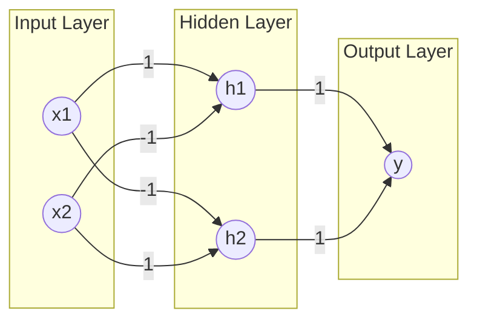
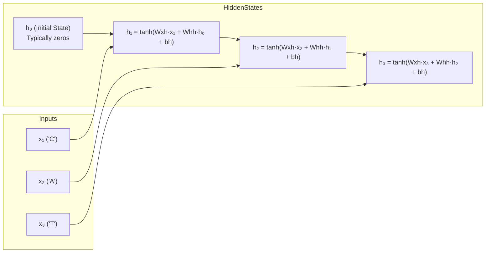

# Neural Network Solutions: XOR, Neuron Output, Gradient Descent, and Adam Optimizer

## 16. XOR Classification with 2-Layer Neural Network

**Question:** Consider the XOR truth table. Show how a 2-layer feedforward neural network (with 2 hidden units) can correctly classify XOR.

**Answer:**

### XOR Truth Table
| x₁ | x₂ | XOR Output |
|----|----|------------|
| 0  | 0  | 0          |
| 0  | 1  | 1          |
| 1  | 0  | 1          |
| 1  | 1  | 0          |

### Network Architecture
A 2-layer feedforward neural network with 2 hidden units can solve XOR using the following architecture:

```
Input Layer (x₁, x₂) → Hidden Layer (h₁, h₂) → Output Layer (y)
```

### Mathematical Implementation
Using step activation function: f(z) = 1 if z ≥ 0, else 0

**Hidden Layer:**
- h₁ = f(1·x₁ - 1·x₂ - 0.5)  // Computes x₁ AND NOT x₂
- h₂ = f(-1·x₁ + 1·x₂ - 0.5) // Computes NOT x₁ AND x₂

**Output Layer:**
- y = f(1·h₁ + 1·h₂ - 0.5)   // Computes h₁ OR h₂

### Verification Table
| x₁ | x₂ | h₁ | h₂ | y  | XOR |
|----|----|----|----|----|-----|
| 0  | 0  | 0  | 0  | 0  | 0   |
| 0  | 1  | 0  | 1  | 1  | 1   |
| 1  | 0  | 1  | 0  | 1  | 1   |
| 1  | 1  | 0  | 0  | 0  | 0   |

### Network Diagram


## 17. Neuron Output with ReLU Activation

**Question:** A neuron has input vector X = [1, 2], weight vector W = [0.5, -0.4], and bias = 0.2. Compute the output of the neuron using the ReLU activation function.

**Answer:**

### Calculation
1. Compute weighted sum:
   ```
   z = (W·X) + b = (0.5×1) + (-0.4×2) + 0.2
     = 0.5 - 0.8 + 0.2 = -0.1
   ```

2. Apply ReLU activation:
   ```
   ReLU(z) = max(0, -0.1) = 0
   ```

**Final Output:** 0

## 18. Gradient Descent Weight Update

**Question:** For a small dataset with loss function values: 4, 2.8, 2.1, 1.7, 1.5 (at iterations 1-5), compute the gradient descent weight update for learning rate η = 0.1 (assume gradient = loss value for simplicity).

**Answer:**

### Weight Update Calculation
Using update rule: Δw = -η × gradient = -η × loss

| Iteration | Loss | Weight Update (Δw) |
|-----------|------|---------------------|
| 1         | 4.0  | -0.1 × 4.0 = -0.4   |
| 2         | 2.8  | -0.1 × 2.8 = -0.28  |
| 3         | 2.1  | -0.1 × 2.1 = -0.21  |
| 4         | 1.7  | -0.1 × 1.7 = -0.17  |
| 5         | 1.5  | -0.1 × 1.5 = -0.15  |

**Final Weight Update at Iteration 5:** -0.15

## 19. Adam Optimizer Weight Update

**Question:** Perform one iteration of weight update using the Adam optimizer for a parameter with: Gradient = 0.2, β₁ = 0.9, β₂ = 0.999, Learning rate = 0.01, Initial m = 0, v = 0.

**Answer:**

### Adam Update Steps
1. Update first moment estimate:
   ```
   m = β₁·m + (1-β₁)·g = 0.9×0 + 0.1×0.2 = 0.02
   ```

2. Update second moment estimate:
   ```
   v = β₂·v + (1-β₂)·g² = 0.999×0 + 0.001×0.04 = 0.00004
   ```

3. Compute bias-corrected estimates:
   ```
   m̂ = m / (1-β₁¹) = 0.02 / 0.1 = 0.2
   v̂ = v / (1-β₂¹) = 0.00004 / 0.001 = 0.04
   ```

4. Update parameter:
   ```
   Δw = -η × m̂ / (√v̂ + ε) = -0.01 × 0.2 / (√0.04 + 10⁻⁸)
     = -0.01 × 0.2 / (0.2 + 10⁻⁸) ≈ -0.01 × 1 = -0.01
   ```

**Parameter Update:** -0.01

# Unrolled RNN for Sequence "CAT"
20.	Suppose you are applying an RNN for sequence modeling of the string “CAT”. Draw the unrolled RNN diagram for 3 time steps and explain how the hidden state is updated at each step.

## Unrolled RNN Diagram

The unrolled RNN for the sequence "CAT" over 3 time steps can be visualized as follows:



## Hidden State Update Explanation

At each time step, the hidden state is updated using the following equation:
$$
h_t = \tanh(W_{xh} \cdot x_t + W_{hh} \cdot h_{t-1} + b_h)
$$

Where:
- $W_{xh}$ is the weight matrix connecting input to hidden state
- $W_{hh}$ is the weight matrix connecting previous hidden state to current hidden state
- $b_h$ is the bias term
- $\tanh$ is the hyperbolic tangent activation function

### Step-by-Step Update Process:

1. **Time Step 1 (t=1) - Processing 'C':**
   - Input: $x_1$ = 'C' (encoded as a vector)
   - Previous hidden state: $h_0$ (typically initialized to zeros)
   - Update: $h_1 = \tanh(W_{xh} \cdot x_1 + W_{hh} \cdot h_0 + b_h)$
   - $h_1$ captures information about the first character 'C'

2. **Time Step 2 (t=2) - Processing 'A':**
   - Input: $x_2$ = 'A'
   - Previous hidden state: $h_1$
   - Update: $h_2 = \tanh(W_{xh} \cdot x_2 + W_{hh} \cdot h_1 + b_h)$
   - $h_2$ combines information from both 'C' and 'A'

3. **Time Step 3 (t=3) - Processing 'T':**
   - Input: $x_3$ = 'T'
   - Previous hidden state: $h_2$
   - Update: $h_3 = \tanh(W_{xh} \cdot x_3 + W_{hh} \cdot h_2 + b_h)$
   - $h_3$ contains information from the entire sequence "CAT"

## Key Properties:
- The hidden state serves as a memory that accumulates information from previous time steps
- At each step, the hidden state is a function of both the current input and the previous hidden state
- This allows the RNN to capture dependencies and patterns across the sequence
- The final hidden state $h_3$ represents the network's understanding of the entire sequence "CAT"
